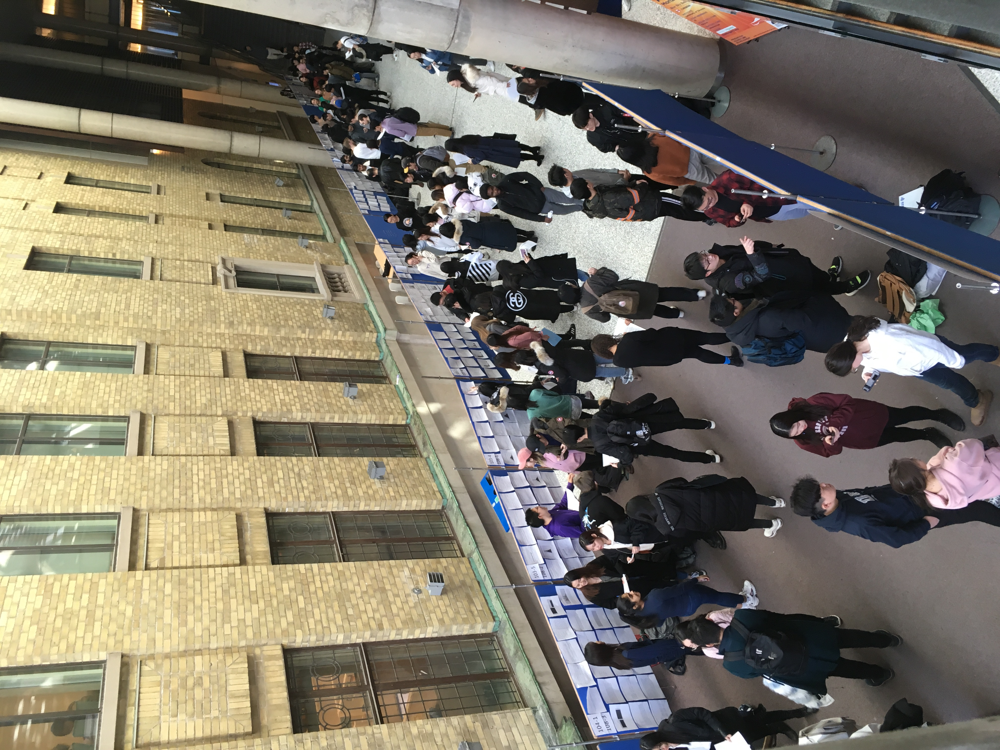
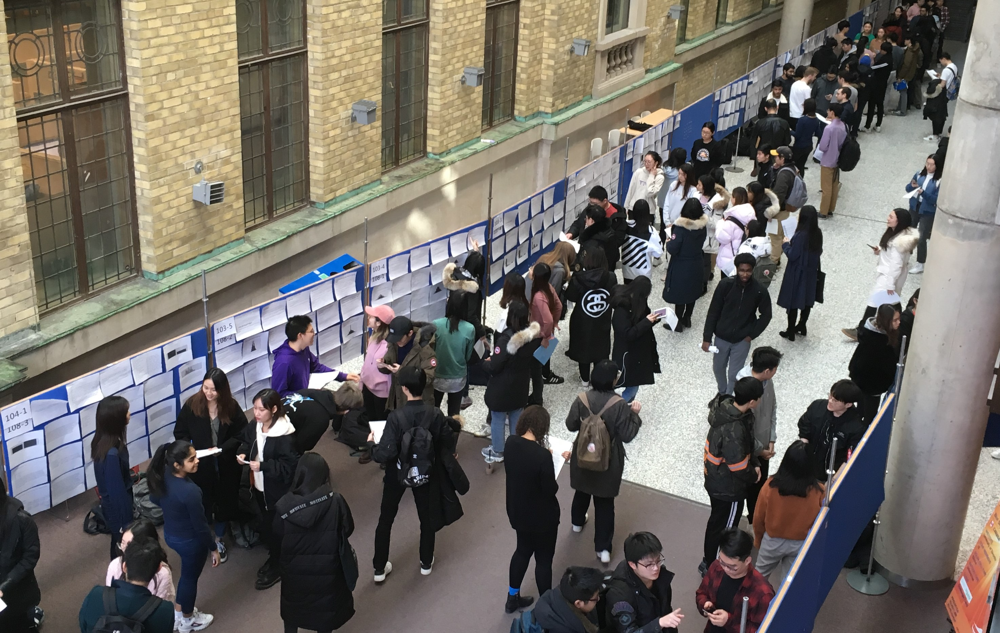

# Fall 2022 STA130: Introduction to Statistical Reasoning and Data Science

### Welcome!

> *Welcome to your Fall 2022 semester and STA130!* **STA130 Lectures** are Monday's 9:10AM/2:10PM ET for L0101/L0201, and **STA130 Tutorials** are Friday's 9:10AM/2:10PM ET for L0101/L0201. The Fall 2022 term begins September 8, but we won't meet in person for a tutorial on the first Friday, September 9th; instead, you are expected to use your two-hour tutorial block to review the course website and get a head start on familiarizing yourself with R based on your review of the course website.  See you in Lecture on Monday, September 12th!
> 
> -- STA130 Instructor Prof. Scott Schwartz  
> Assistant Professor, Teaching Stream  
> Director, Data Science Programs for Statistical Science   
> 
> P.S. Just call me Scott
---

> *Prior to Winter 2020 this was an **In-Person** course (e.g., [F18](https://ntaback.github.io/UofT_STA130/Fall2018/fall2018_course_content.html), [F19](https://www.statistics.utoronto.ca/sites/www.statistics.utoronto.ca/files/STA130_syllabus_F19.pdf), [W20](https://www.statistics.utoronto.ca/sites/www.statistics.utoronto.ca/files/STA130H1S.pdf)). From Fall 2020 to Winter 2022 it was transitioned to an **Online** course (e.g., [W22](https://q.utoronto.ca/courses/253019)). The current course transitions these iterative course developments back into the previous **In-Person** format. Specifically, the Winter 2022 Online [.ppt and pre-recording material](https://q.utoronto.ca/courses/253019) is integrated into leveraged and reworked [Rstudio Rmd](https://can01.safelinks.protection.outlook.com/?url=https%3A%2F%2Fwww.dropbox.com%2Fl%2Fscl%2FAACmrT8hzMyabinD1Ioc4_CWCLbgwhZx4lU&data=05%7C01%7Cscott.schwartz%40utoronto.ca%7C07bd03b4049f4302640108da3e67cd9b%7C78aac2262f034b4d9037b46d56c55210%7C0%7C0%7C637890913830493523%7CUnknown%7CTWFpbGZsb3d8eyJWIjoiMC4wLjAwMDAiLCJQIjoiV2luMzIiLCJBTiI6Ik1haWwiLCJXVCI6Mn0%3D%7C2000%7C%7C%7C&sdata=7uY5HYCnQ9Rqp4U5KOSh9UigGyzhCfymDSehiQSC6xA%3D&reserved=0) and [beamer pdf](https://ntaback.github.io/UofT_STA130/Fall2018/fall2018_course_content.html) materials of the previous **In-Person** courses.*

### The philosophy and purpose of STA130

At the highest level, the course activities are meant to develop and practice the final two steps the statistical and data science workflow:

|1. *We'll not be making you struggle to get data yourself* &nbsp;&nbsp;&nbsp;&nbsp;&nbsp;&nbsp;&nbsp;&nbsp;&nbsp;&nbsp;&nbsp;&nbsp;&nbsp;&nbsp;&nbsp;&nbsp;&nbsp;&nbsp;&nbsp;&nbsp;&nbsp;&nbsp;&nbsp;&nbsp;&nbsp;&nbsp;&nbsp;&nbsp;&nbsp;&nbsp;&nbsp;&nbsp;&nbsp;&nbsp;&nbsp;&nbsp;&nbsp;&nbsp;&nbsp;&nbsp;&nbsp;&nbsp;&nbsp;&nbsp;&nbsp;&nbsp;&nbsp;&nbsp; 2. Extract meaning from data through coding and analysis  3. Communicate findings through writing and speaking||
|-|:-:|
| | [Dr. Julia Lowndes'](https://github.com/allisonhorst/stats-illustrations/raw/master/openscapes/) version of Grolemund & Wickham's classic R4DS schematic [illustrated](https://github.com/allisonhorst/stats-illustrations#hello) by [@Allison_Horst](https://twitter.com/allison_horst?lang=en).|

<!-- image is now from https://bookdown.org/gavinmasterson/dvfc which could be a good resource? Reminds me of communicating data course UVA -->
<!-- previously https://github.com/allisonhorst/stats-illustrations/raw/master/openscapes/environmental-data-science-r4ds-general.png -->
<!-- but now see also https://www.openscapes.org/gallery/ and https://github.com/Openscapes/teaching-learning-resources-->

### The 5 Learning Objectives of STA130

Specifically, STA130 has the following **5 Learning Objectives**:

1. Implement the computational steps involved in the management and statistical analysis of data using R.
2. Carry out a variety of statistical analyses in R and interpret the results of the analyses.
3. Clearly communicate the results of statistical analyses to technical and non-technical audiences.
4. Identify appropriate uses of statistical methods to answer questions, including their strengths and weaknesses.
5. Describe how statistical methods can be used to learn from data, including methods for description, explanation, and prediction.

# Table of Contents

Please see below for information regarding the following topics:

- [Schedule](#schedule)
- [Grading](#grading)
  - [Accomodations](#accomodations)
  - [Best 7 of X policy](#best-7-of-X-policy)
    - [Student Health](#best-7-of-X-policy)  
  - [Participation](#participation)
- [Help](#help)
- [Calendar](#calendar)
- [Course project](#course-project)
  - [Course project requirements and scope](#course-project-requirements-and-scope)
  - [Course project data](course-project-data)

- [Outline](#outline) (where you'll find all the course material)

## Schedule

The course (on average across students) should take 10 hours a week with 7 hours allocated for

| Section     |             | Monday     | Thursday       | Friday     |
|-------------|-------------|------------|----------------|------------|
|  L0101      |  9:10 AM ET | Lec (2hrs) |                | In-Person Tut work (2hrs) |
|  L0201      | 2:10 PM ET  | Lec (2hrs) |                | In-Person Tut work (2hrs) | 
| L0101+L0201 | 5:00 PM ET  |            | R (2hr) HW Due |            |
| L0101+L0201 | 10:00 PM ET |            |                | Tut work (+1hr) Due |

and 3 hours left available for study and review, office hours and piazza discussion boards, and eventual team project work.
Professor Office Hours will be Wenesday from 5-7 p.m. ET online at https://utoronto.zoom.us/j/2910373742. Student questions and conversation will be prioritized, and any remaining time will be spent on interactive code walkthoughs, demonstrations, and  discussions.

## Grading

| Components             | Notes                | Absence Policy            | Accomodation Requests | 
|------------------------|----------------------|---------------------------|-----------------------|
| 7% R Homework          | 10 assignments       | Best 7/10 are Scored      | See below             |
| 14% In-Person Tut work | 9 activities         | Best 7/9 are Scored       | See below             |
| 20% Course project     |                      | Due Dec 8th               | Emergency Absenses ONLY  |
| 20% Midterm            |                      | Reweights to Final if Missed | Automatic          |
| 34% Final exam         |                      | Excused Absence Rescheduling | Handled through FAS |
| 5% Participation       | Mentorship + Surveys | Due Dec 8th               | No Extensions Available |
| N/A Lectures           | Not Recorded         | N/A                       | Lecture `.Rmd`+Slides Available |
| N/A Study Material     | Not Graded           | Optional Material         | N/A                   |

#### Accomodations

| Accomodation | Contingency Request Recipient(s) | Notes |
|-|-|-|
| Best 7 of X policy | Automatic: no student action required |
| Extended 7 of X policy | [College Registrar](https://www.artsci.utoronto.ca/current/academic-advising-and-support/college-registrars-offices) + sta130@utorono.ca | Notice must be provided within one week of return to UofT activities |
| Final Exam | [FAS Exam Deferrel Petition](https://www.artsci.utoronto.ca/current/faculty-registrar/petitions/deferred-exams) | The Faculty of Arts and Sciences administers the final exam |
| Miderm Exam | Final Reweighting | This is automatic so no request is required | 
| Course Porject | sta130@utorono.ca | Extensions will be granted only for Emergency Absenses ONLY |

#### Best 7 of X policy

For students having a "normal" experience acclimating to the UofT context, 
this should provide a comfortable buffer against minor unexpected events or schedule management growing pains. For example

- if you have several assignments due at once and are unable to complete an R Homework assignment in time
- if you're not feeling well and are unable to attend TUT and turn in the TUT activity work in time

you'll get a "zero" but, but only your **7 best scores** for Problem Sets/Tutorial Work will count towards for the final score.

***Physical Health***: This policy is intended support your ability to make positive personal and community health choices.  This policy should encourage staying home and resting when it's the right thing to do. 

***Personal Well-Being***: It is increasingly understood that belonging and community are extremely important for our emotional health, and coming to class and doing your work is a part of your sense of belonging in our community. Sometimes it can be good to "take a break", too, and this policy certainly covers that.

Contingencies if the **Best 7 of X policy** is not sufficient can be initiated and explored through your [College Registrar](https://www.artsci.utoronto.ca/current/academic-advising-and-support/college-registrars-offices) and can be accomodated upon the recommendation of the Registrar with the following limitations:

- Accomodations involving **three absences** due to health related issues will be considered provided that notice of the advent of special circumstances is made to both (a) the [College Registrar](https://www.artsci.utoronto.ca/current/academic-advising-and-support/college-registrars-offices) and (b) sta130@utorono.ca within one week of return to University activities. 
- Accomodations beyond the **Best 7 of X policy** involving one or two health related absences will not be considered.
- Accomodations beyond the **Best 7 of X policy** involving time management challenges will not be considered.

#### Participation

Complete the DoSS STA130 mentorship program. The STA130 mentorship program is composed of 3 pillars designed to facilitate your engagement and inclusion in our community. To get credit for each pillar you must BOTH (a) attend an event (b) and submit a reflection of your experience. Reflections are due by 10 p.m. ET on December 8th.

- Mentor meeting (1%)
- Career event (1%)
- Social event (1%) 

Help us with "get to know the class" and "how'd we do" surveys.

- Beginning of course survey (1%)
- End of course survey (1%)

## Help

| Ask your Tut TA | Get One on One Help | Get help from Classmates | 
|-|-|-|
| Friday Tuts | TA Online Office Hours | Online Discussion Board |

## Calendar

Fall 2022 semester begins Thursday, September 8th.  Friday, September 9th there is no tutorial. 
The first day of class and the first day of tutorial occur during the week of September 12th.

| Week | Week of | Topic                                     | Monday Lec     | Thursday 5PM | Friday Tut | Friday 10PM |
|------|---------|-------------------------------------------|----------------|--------------|------------|------------|
| 1    | Sep 12  | [Jupyterhub, Rstudio, R Basics](#week-1-jupyterhub-rstudiormd-and-r-basics-and-libraries)             | 9:10AM/2:10PM | HW1 Due      | 9:10AM/2:10PM    | Tut 1 Due  |
| 2    |Sep 19  | [Distributions and Statistics](#week-2-data-types-ggplot2-and-lower-case-statistics)              | 9:10AM/2:10PM | HW2 Due      | 9:10AM/2:10PM    | Tut 2 Due  |
| 3    |Sep 26  | [Data Wrangling with Tidy](#week-3-tidy-data-and-data-wrangling)                  | 9:10AM/2:10PM | HW3 Due      | 9:10AM/2:10PM    | Tut 3 Due  |
| 4    |Oct 3   | [One/Two Sample Hypothesis Testing](#week-4-one-and-two-sample-hypothesis-tests)     | 9:10AM/2:10PM | HW45Part2 Due| 9:10AM/2:10PM    | Tut 4 Due  |
| 5    |Oct 10  | *THANKSGIVING DAY: NO CLASS, RESCHEDULED  |               | HW45Part3 Due| 9:10AM/2:10PM    | **Projet Introduction** |
| 6    |Oct 17  | [Bootstrap Confidence Intervals](#week-6-bootstrap-confidence-intervals)            | 9:10AM/2:10PM | HW6 Due      | 9:10AM/2:10PM    | Tut 5 Due  |
| 7    |Oct 24  | **Midterm Review**                        | 9:10AM/2:10PM |              | 9:10AM/2:10PM    | **Midterm Exam**   |
| 8    |Oct 31  | [Simple Linear Regression](#week-8-simple-linear-regression)                  | 9:10AM/2:10PM | HW7 Due      | 9:10AM/2:10PM    | Tut 6 Due  |
| 9    |Nov 7   | READING WEEK                              |                |              |                   |            |
| 10   |Nov 14  | [Multivariate Linear Regression](#week-10-multivariate-linear-regression)                      | 9:10AM/2:10PM | HW8 Due      | 9:10AM/2:10PM    | Tut 7 Due  |
| 11   |Nov 21  | [Classification Decision Trees](#week-11-classification-decision-trees)                      | 9:10AM/2:10PM | HW9 Due      | 9:10AM/2:10PM    | Tut 8 Due  |
| 12   |Nov 28  | Study Design, Confounding, Ethics         | 9:10AM/2:10PM | HW10 Due      | 9:10AM/2:10PM    | Tut 9 Due  |
| 13   |Dec 5   | **Final Review**                          | 9:10AM/2:10PM |              |                   |            |
|  |       | *Oct 10 -> Dec 8th Reschedule             |                | **Thursday** |                   |            |
|   |      |                                           |                | **Dec 8th**  |                   |            |
|    |     |                                           |                | **9:10AM/2:10PM**        |      |            |
|     |    |                                           |                | **Project (DUE)**  |                   |            |
|      |   |                                           |                | **Presentations** |              |            |

Week 11: Classification Trees

## Course project

The course project is meant to give you an example of what it can be like to be a statistician doing applied research work.  To give you an authentic, real experience I'd like you to join me on one of my own current projects. This way you'll be able to see what real research work is like (at least for an ' $n \text{ of } 1$ ', me!).

Before I moved to UofT I taught at the [University of Virginia](https://www.virginia.edu/) [School of Data Science](https://datascience.virginia.edu/).

> Fun fact: The [UVA School of Data Science](https://datascience.virginia.edu/pages/uva-plans-new-school-data-science) is the 12th school of the [premier](https://www.usnews.com/best-colleges/uva-6968/overall-rankings) US university originally founded by [Thomas Jefferson](https://www.virginia.edu/aboutuva), the [principal author](https://en.wikipedia.org/wiki/Thomas_Jefferson) of the US [Declaration of Independence](https://en.wikipedia.org/wiki/United_States_Declaration_of_Independence).

While I was at UVA I met [Dr. Heman Shakeri](https://datascience.virginia.edu/people/heman-shakeri) who works in conjuction with the [Department of Biomedical Engineering](https://engineering.virginia.edu/departments/biomedical-engineering) and 
[Systems Biology and Biomedical Data Sciences](https://engineering.virginia.edu/departments/biomedical-engineering/research/systems-biology-and-biomedical-data-sciences). Heman's (Dr. Shakeri's) research involves using "data-driven identification and control of high-dimensional dynamical systems" to detect deviations away from normal cellular function and intervene to interrupt the pregression of cancer before it can establish a deleterious cellular homeostasis. As with many people, Heman's interest in this area is motivated by the personal experience of a close family friend. Heman's work is movtivated by his hope that his research will help give family's more time with their loved ones and close friends.

In my career I've worked in [Integrative Biology](https://sites.cns.utexas.edu/juenger_lab/),
[Nutrition and Complex Disease](https://chapkinlab.tamu.edu), and [Next Generation Sequencing](https://www.txgen.tamu.edu) labs. I've actually been a "Bioinformatician" for about the same amount of time that I've been a "Data Scientist" (in industry) and "Statistician" (here in academia, since my PhD is in Statistics).  So, with that in mind, when Heman and I talk about our research, our conversations look something like the following.

> The data we will work with is based on advances in the fields of [Flow Cytometry](https://www.ncbi.nlm.nih.gov/pmc/articles/PMC5939936/) for single cell analysis and [Mass Spectrometry](https://www.broadinstitute.org/technology-areas/what-mass-spectrometry) for measurement of cellular proteomic processes (the [phenotypical process endpoint](https://en.wikipedia.org/wiki/Central_dogma_of_molecular_biology) of cellular function and behavior). Based on these technologies, the multivariate landscape of proteomic activity can be measured for a single cell in any experiemental condition for any cell type (e.g., cancerous and benign cellular lines) at scale. By understanding typical cellular homeostatis of healthy and deliterious cells, and observing the phenotypical transformation of cellular proteomic homeostatsis over time in response to different experimental conditions, we may eventually be able to understand how to direct deleterious cellular states to transition into non-deleterious states. And with this "data-driven identification and control of high-dimensional dynamical systems" we will be able to fight cancer!

Now, if you didn't catch all (or any of that) on your first reading, that sounds about right.  I'm a seasoned professional (I got my PhD in 2010) and you're a first year college student... I have a 20-year head start on you. Let me break it down for you a little more with more focus on the data rather than the science and technology.

> The data observations simultaneously measure 22 so-called [AP-1 transcription factors](https://en.wikipedia.org/wiki/AP-1_transcription_factor) 
> and 4 phenotype proteins. So there are 26 total variables, 22 of which are thought of as "casues" and 4 of which are thought of as "outcomes". Each measurement is taken on a signle cell; but, we can actually measure lots and lots of individual cells; and, we can do the measurements under different experiemental conditions. This lets us repeatedly observe these 21 variables over lots of different cells under lots of different treatment conditions; and, we can also measure the different treatment conditions at different stages of progression.
> - How can we measure the progression over time? Actually, we can't measure the same cells over and over. To make a measurement on a cell we have to destroy it... but, if we take a batch of cells (in a specific experimental condition) then we can split the cells up into groups and make the measurements on the different groups at different times; thus, we observe "the progression of the experimental condition over time".
>
> So for each experimental condition $x$ and time $t$ we have the tidy data table
>
>
>| | TF1 | TF2 | TF3 |  $\vdots$| TF20 | TF21 | TF22 | Y1 | Y2 | Y3 | Y4 | Drug | Dosage | Time | Rep |
>|-|-----|-----|-----|----------|------|------|------|----|----|----|----|------|--------|------|-----|
>|1|     |     |     |          |      |      |      |    |    |    |    |      |        |      |     |
>|2|     |     |     |          |      |      |      |    |    |    |    |      |        |      |     |
>|$\vdots$|  |   |   |          |      |      |      |    |    |    |    |      |        |      |     |
>|$n$|  |   |   |          |      |      |      |    |    |    |    |      |        |      |     |
>
> where the total number of observations $n = \sum_x \sum_t n_{xt}$ is the sum of all the samples $n_{xt}$ in each condition $x$ and time $t$ (which will be different since different batches of cells so we don't always have the same number of observations).
>
> - Note that "the number of observations" is the "number of individual cells" on which the measurements have been made.
>
> The experimental conditions $x$ are defined by two drugs and their dosage, and each condition is repeated a few times for validation purposes.

This should be a little more comprehensible now. And actually, you've just had your first formal experience as a statistical consultant!  How so?  Well, in my experience as a statistical, bioinformatic, and data science consultant, the exercise you've just done is exactly what happens.  You meet someone, they tell you about their applied problem, and then you would work to learn what the context is and understand what their problem actually is.  So if you need, review things here a little bit more, and work to make yourself more comfortable with what this project is all about!  

- The great thing about being a consultant in a statistical, bioinformatic, or data science role is how much you get to learn about different application areas. It's an especially great context in which to learn because the people you're learning from are experts in their problem and very knowlegable in their domain of expertise.  Stastistics and data science in particular are quite unique fields in this regard, since statistical and data science expertise is applicable in so many different areas. This means the natural directionality is that methods are taken to data, and so statistical and data science roles are naturally involve more learning about new areas than is generally the case in other disciplines. 

Continuing with the theme of being a statistical consultant, let's start thinking about this problem from a statistical perspective.  What analyses would be helpful for this data?  Here is my own thought process about what we could do with this data.

1. *Do protein levels in experimental condition* $x$ *change over time* $t$? $\longrightarrow$ **Two Sample Hypothesis Testing**
2. *Are protein levels at time* $t$ *different between experimental conditions* $x_1$ *and* $x_1$? $\longrightarrow$ **Two Sample Hypothesis Testing**
3. *At time* $t$ *in experimental condition* $x$, *what is the relationship between different proteins*? $\longrightarrow$ **Correlation Hypothesis Testing**
4. *Can we predict phenotypical outcomes (Y)* ***valule/state*** *from transcription factors (TF)*? $\longrightarrow$ **Regression/Classification**
5. *At what times* $t$ *in experimental conditions* $x$ *can we do this*? $\longrightarrow$ **Regression/Classification**
6. *At time* $t$ *in experimental condition* $x$, *what TF are most predictive of Y*  ***value/state***? $\longrightarrow$ **Regression/Classification**
7. Are there patterns in the patterns? Each above analyses is a result, but what's the analysis of the results themselves? $\longrightarrow$ meta...

Of the analyses proposed above, we've so far only covered **Hypothesis Testing**.  A good place to both get started on the project as well as familiarize yourself with the data would be to start with some **Hypothesis Testing** on the data.  In general, you can use the project to reinforce the topics we're learning by trying them out on the project data. Not only will this be beneficial for your learning, but it will help you avoid a last-minute rush to create your material for the **Project Poster Presentations on Thursday, December 8th**.  For example, I haven't listed any analyses using ***Confidence Intervals***, but these are the next tool we'll cover in the course. How can we use ***Confidence Intervals*** in the context of our course project data?

| | |
|-|-|
|||

### Course project requirements and scope

#### Your Project Poster will be evaluated based on the presentation of 3 of the 5 distinct categories of analyses noted above (Hypothesis Testing, Confidence Intervals, Correlation, Regression, Classification) and the use of supporting visualizations and explanation.

*Outstanding projects will successfully accomplish the required tasks as part of a coherent narrative addressing the bigger picture of the project: what is "good" cellular homeostasis, and how can "bad" cellular homeostasis be changed to be "good"?*

> For the purposes of the course project, your objective is to answer three questions like those from 1-6 above for our data from our collaborator Dr. Shakeri. Question 7 is not required for the project, but you may be interested in pursuing it anyway:
> - How do the observed correlations evolve over time under the different experimental conditions?
> - Is this temporal dynamic *itself* predictive of the eventual state of the downstream cellular phenotypes?
> - Are the temporal dynamic different or somehow controlled by the experimental conditions?
>
> By looking at these more advanced "meta" questions, we may be able to understand the inter-dependence of the AP-1 proteins, their driving relationship with downstream cellular phenotypes, and how we may be able intervene along this pathway to induce transformation away from deletarious cellular states. Which brings us full circle to our collaborators research objectives.
> > By understanding typical cellular homeostatis of healthy and deliterious cells, and observing the phenotypical transformation of cellular proteomic homeostatsis over time in response to different experimental conditions, we may eventually be able to understand how to direct deleterious cellular states to transition into non-deleterious states. And with this "data-driven identification and control of high-dimensional dynamical systems" we will be able to fight cancer!
>
> If there are certain correlation structures in the TF proteins that leads to good and bad phenotype outcome states Y, can we affect the correlation structure of the TF proteins with some treatment which changes the state from a bad phenotype to a good one.

There will be 3 project teams of 3-4 students per TUT group. Working groups are one of the primary communities we are a part of in life. Take advantage of the opportunity to make connections with your peers!  Collaborative work is -- and I cannot stress this enough -- **A HUGE** part of the being a Statisticain or a Data Scientist. So take this opportunity to practice being a good team member. Learn from your peers, meet your peers where they're at and be charitable and generous in your interactions with them, and do your best to be supportive and helpful to your team.  You will need to work as a team to plan your project strategy, divide and assign tasks, and collaboratively improve and refine your work. Be constructive and help synergize your teams potential!

- There are many things to explore in this data. But remember, the project is scored based on your presentation of 3 of the 5 distinct categories, not the exhaustiveness of your analysis. It is worth spending time on exploratory data analysis (EDA) as it will help you form your initial objectives and guide any advanced work you do beyond the basic project requirements; but, if you find your EDA requiring too much time and effort, then you need to quickly determine how you can reduce the scope of your efforts.  You will never be able to do everything you want to with a data set, and you need to be comfortable working efficiently towards clear and achieveable objectives while avoiding "analysis paralysis" -- this is a very important skill for being effective and productive as a statistician or a data scientist.
 
  > When you're examining the dependency between the proteins, only examine the different proteins within one particular treatment condition at first. If you're consider comparing analyses across different treatment conditions, it's first to best to confirm that repeated batches (`Rep`) are behaving reproducibly. If you are starting to compare different treatment conditions, it's best to start by just comparing two different treatment conditions, and perhaps it makes the most sense to to the first and last timepoints within a drug since those should show the greatest differentiation.

### Course project data

The data for the course project comes from [this article](https://www.biorxiv.org/content/10.1101/2021.12.06.471514v1.full) finding that the 
"AP-1 transcription factor network" (i.e., the relative distributions and dependency relationships of transcription factors) are predictive of "cellular plasticity in melanoma" (i.e., how easily changable the phenotypes are melanoma cell lines), and is available for download [here](https://drive.google.com/uc?id=1m-bc56NfKErzkxdlHXBLWQg14W2R2vd8&export=download)

| Phenotype Indicators      | MiTFg | Sox10 | NGFR | AXL | | | |
|--------------------------:|-------|-------|------|-----|-------------|-------------|-------------|
| AP-1 transcription factors| ATF2  |ATF3   | ATF4 | ATF5|Phospho_ATF1 | Phospho_ATF2 | Phospho_ATF4|
|                           | ATF6  | JunB  |c_Jun |JunD | Phospho_S6  |Phospho_c_Jun | Phospho_Erk1 |
|    NF_kappaB              | Fra1  | Fra2  | c_Fos|Ki_67 | Phospho_Fra1 | Phospho_c_Fos | Phospho_p38 |

The cellular phenotypes of melanoma cell can be characterized in terms of the HIGH/LOW balance of the four phenotype indicators MiTFg, NGFR, SOX10, and AXL as follows

| Cellular Phenotype \ Gene  | MiTFg| NGFR | SOX10 | AXL |
|----------------------------|------|------|-------|-----|
| Undifferentiated           | LOW  | LOW  | LOW   | HIGH|
| Neural crest-like          | LOW  | HIGH | HIGH  | HIGH| 
| Transitory                 | HIGH | HIGH | HIGH  | LOW |
| Melanocytic                | HIGH | HIGH | LOW   | LOW |

where the HIGH/LOW distinctions are determined empirically from the data.

### Course project planning assignment

As a group you must submit a proposal for how you plan to collaborate and work together, as well as a general roadmap of your groups strategy for accomplishing the tasks of the course project. Detail how you will systematically explore the data and the applicability and results of applying the methods you're learning to the data. 

## Outline

### Week 1: Jupyterhub, Rstudio/Rmd, and R Basics and Libraries

| [Slides](https://github.com/pointOfive/STA130_Week1_Slides) [[Jupyterhub](https://jupyter.utoronto.ca/hub/user-redirect/git-pull?repo=https%3A%2F%2Fgithub.com%2FpointOfive%2FSTA130_Week1_Slides&urlpath=rstudio%2F&branch=main)] + [Demo](https://github.com/pointOfive/STA130_Week1_Demo) [[Jupyterhub](https://jupyter.utoronto.ca/hub/user-redirect/git-pull?repo=https%3A%2F%2Fgithub.com%2FpointOfive%2FSTA130_Week1_Demo&urlpath=rstudio%2F&branch=main)] | [Problem Set](https://github.com/pointOfive/STA130_ProblemSet1) [[Jupyterhub](https://jupyter.utoronto.ca/hub/user-redirect/git-pull?repo=https%3A%2F%2Fgithub.com%2FpointOfive%2FSTA130_ProblemSet1&urlpath=rstudio%2F&branch=main)] due [on Quercus](https://q.utoronto.ca/courses/239327/quizzes/269319) by 5 p.m. ET Thursday |
|-|-|
| [PollEV](https://pollev.com/sta) In-Class Questions Round [1](https://PollEv.com/surveys/i80dlyI1tanNNrvFwC74C/respond), [2](https://PollEv.com/surveys/a5mpfyaCt7s2wjpd4g1cy/respond), [3](https://PollEv.com/surveys/TTyRWyCnpBiQlDENmFG9E/respond), [4](https://PollEv.com/surveys/Y04VP2B2iE7j4gtHBTMPq/respond), [5](https://PollEv.com/surveys/iyPJyiwyHLcjmF3kbQNwo/respond) | |

Week 1 is concerned with introducing students to [R](https://www.r-project.org/) and R libraries (like [tidyverse](https://www.tidyverse.org/)), [Rstudio](https://www.rstudio.com/) and [UofT's Jupyterhub](https://jupyter.utoronto.ca). Our primary reference resources in this task are

- the [R for Data Science](https://r4ds.had.co.nz/) (R4DS) textbook by Hadley Wickham & Garret Grolemund (previously [Hands-On Programming with R](https://d1b10bmlvqabco.cloudfront.net/attach/ighbo26t3ua52t/igp9099yy4v10/igz7vp4w5su9/OReilly_HandsOn_Programming_with_R_2014.pdf))
  - specifically the [Introductory R](https://r4ds.had.co.nz/workflow-basics.html) and [R Markdown](https://r4ds.had.co.nz/r-markdown.html) material
- online Markdown [tutorials](https://www.markdownguide.org/getting-started/), [cheetsheats](https://github.com/adam-p/markdown-here/wiki/Markdown-Cheatsheet), and [resources](https://www.markdowntutorial.com/)
- the [DoSS Toolkit](https://dosstoolkit.com/) created by seasoned STA130 Profs. Alexander and Caetano et al.
  - specifically the [RStudio](https://dosstoolkit.com/#hello-world), [errors](https://dosstoolkit.com/#operating-in-an-error-prone-world),
and [packages](https://dosstoolkit.com/#holding-the-chaos-at-bay) [tutorials](https://dosstoolkit.com/#if-you-have-never-used-r-before)
- [RStudio R](https://rstudio.cloud/learn/primers/1.2) and [R Markdown](https://rmarkdown.rstudio.com/) primers 
  - and see also RStudio's [R Markdown](https://raw.githubusercontent.com/rstudio/cheatsheets/main/rmarkdown.pdf) and [RStudio](https://raw.githubusercontent.com/rstudio/cheatsheets/main/rstudio-ide.pdf) [cheatsheets](https://www.rstudio.com/resources/cheatsheets/)
- and [free online introductions to R](https://www.datacamp.com/courses/free-introduction-to-r) from learning websites like [datacamp](https://www.datacamp.com/).

> The [UofT Jupyterhub](https://jupyter.utoronto.ca) is a phenomenal resource; however, it is subject to service outages from time to time (which have in the past coincided with assignment due dates), and it can take a long time to load when there's a lot of simultaneous user demand (if a lot of students in our or another class log in at once). When you cannot use [UofT Jupyterhub](https://jupyter.utoronto.ca) you must use your own [local Rstudio instance](https://www.rstudio.com/).

> An extremely valuable skill in the context of coding for statistics and Data Science is troubleshooting and figuring things out.  Resources like the [R for Data Science](https://r4ds.had.co.nz/) textbook and the the [DoSS Toolkit](https://dosstoolkit.com/) are excellent recources to learn things in a systematic, structured, and organized manner; however, google, stack exchange/overflow, and coding blog posts can be an invaluable resource for finding quick solutions for coding bugs and suggestions for how to complete a desired analyses. Hopefully through this class you will take the opportunity to build your self-sufficiency and coding-resiliance.

### Week 2: Data Types, ggplot2, and (lower case) statistics

| [Slides](https://github.com/pointOfive/STA130_Week2_Slides) [[Jupyterhub](https://jupyter.utoronto.ca/hub/user-redirect/git-pull?repo=https%3A%2F%2Fgithub.com%2FpointOfive%2FSTA130_Week2_Slides&urlpath=rstudio%2F&branch=main)] + [Demo](https://github.com/pointOfive/STA130_Week2_Demo) [[Jupyterhub](https://jupyter.utoronto.ca/hub/user-redirect/git-pull?repo=https%3A%2F%2Fgithub.com%2FpointOfive%2FSTA130_Week2_Demo&urlpath=rstudio%2F&branch=main)] | [Problem Set](https://github.com/pointOfive/STA130_ProblemSet2) [[Jupyterhub](https://jupyter.utoronto.ca/hub/user-redirect/git-pull?repo=https%3A%2F%2Fgithub.com%2FpointOfive%2FSTA130_ProblemSet2&urlpath=rstudio%2F&branch=main)] due [on Quercus](https://q.utoronto.ca/courses/239327/quizzes/269319) by 5 p.m. ET Thursday |
|-|-|
| [PollEV](https://pollev.com/sta) In-Class Questions Round [1](https://PollEv.com/surveys/fr3VWMEBXve0CAxxM1rIu/respond), [2](https://PollEv.com/surveys/5I8qbQ9DrPyHPivrRfOjJ/respond), [3](https://PollEv.com/surveys/t0wHO6X6Mb65iBBAlJ6zq/respond) | Ungraded Optional [Quercus Practice Quiz](https://q.utoronto.ca/courses/239327/quizzes/269319) | 

Week 2 differentiates ([numerical](https://www.jove.com/science-education/12573/how-data-are-classified-numerical-data) and [ordinal](https://www.jove.com/science-education/12574/ordinal-level-of-measurement) and [nominal](https://www.jove.com/science-education/12798/nominal-level-of-measurement) data types [categorical](https://www.jove.com/science-education/12797/how-data-are-classified-categorical-data)) and explores the [technical details](https://r4ds.had.co.nz/vectors.html) of [R data types](https://rstudio.cloud/learn/primers/1), which directly informs the choice of [appropriate visualizations of data](https://www.jove.com/science-education-library/160/summarizing-and-visualizing-data). Building on this foundation, the `ggplot2` ["grammer of graphics"](https://www.amazon.com/Grammar-Graphics-Statistics-Computing/dp/0387245448/ref=as_li_ss_tl) syntax is then introduced (with associated learning and refernce resources listed below) using the examples of `bar`, `histogram`, and `boxplot` `geom_`'s (but of course there are [MANY](https://datavizcatalogue.com), [MANY](https://www.data-to-viz.com) other kinds of plots, too). The `fig.size` and `fig.width` [R Markdown sizing parameters](https://r4ds.had.co.nz/graphics-for-communication.html?q=fig.width#figure-sizing) are also introduced at this stage (and again see below for additional R Markdown learning and reference materials). Standard location ([mean](https://www.jove.com/science-education/12810/arithmetic-mean), [median](https://www.jove.com/science-education/12815/median), [mode](https://www.jove.com/science-education/12814/what-is-a-mode)) and [scale](https://www.scribbr.com/statistics/variability/) (range, IQR, variance, standard deviation) statistics for characterizing distributions are introduced, and higher order distributional characterizations are covered ([skewness](https://www.jove.com/science-education/12816/skewness), etc.).

| ggplot2 Resources and References | Markdown Resources and References |
|----------------------------------|-----------------------------------|
| [Official Cheatsheet](https://github.com/rstudio/cheatsheets/blob/main/data-visualization-2.1.pdf)|[RStudio Markdown Cheatsheet](https://www.rstudio.com/wp-content/uploads/2015/02/rmarkdown-cheatsheet.pdf)|
| &nbsp;&nbsp;&nbsp; [Finding Answers](https://ggplot2.tidyverse.org/#getting-help)| &nbsp;&nbsp;&nbsp; [R4DS Introduction](https://r4ds.had.co.nz/r-markdown.html) |
| [Learning Resources](https://ggplot2.tidyverse.org/#learning-ggplot2)| &nbsp;&nbsp;&nbsp; [RStudio Introduction](https://rmarkdown.rstudio.com/) |
| &nbsp;&nbsp;&nbsp; [Official Usage](https://ggplot2.tidyverse.org/#usage)| &nbsp;&nbsp;&nbsp;&nbsp;&nbsp;&nbsp; [knitr Documentation](https://yihui.org/knitr/) | 
| &nbsp;&nbsp;&nbsp; [R4DS Textbook](https://r4ds.had.co.nz/data-visualisation.html)| &nbsp;&nbsp;&nbsp;&nbsp;&nbsp;&nbsp; [.Rmd Documentation](https://bookdown.org/yihui/rmarkdown/) |
| &nbsp;&nbsp;&nbsp; [DoSS Toolkit](https://dosstoolkit.com/#to-ggplot-or-not-to-ggplot)| [Markdown Tutorial](https://www.markdowntutorial.com/)|

### Week 3: Tidy Data and Data Wrangling

| [Slides](https://github.com/pointOfive/STA130_Week3_Slides) [[Jupyterhub](https://jupyter.utoronto.ca/hub/user-redirect/git-pull?repo=https%3A%2F%2Fgithub.com%2FpointOfive%2FSTA130_Week3_Slides&urlpath=rstudio%2F&branch=main)] + [Demo](https://github.com/pointOfive/STA130_Week3_Demo) [[Jupyterhub](https://jupyter.utoronto.ca/hub/user-redirect/git-pull?repo=https%3A%2F%2Fgithub.com%2FpointOfive%2FSTA130_Week3_Demo&urlpath=rstudio%2F&branch=main)] | [Problem Set](https://github.com/pointOfive/STA130_ProblemSet3) [[Jupyterhub](https://jupyter.utoronto.ca/hub/user-redirect/git-pull?repo=https%3A%2F%2Fgithub.com%2FpointOfive%2FSTA130_ProblemSet3&urlpath=rstudio%2F&branch=main)] due [on Quercus](https://q.utoronto.ca/courses/239327/quizzes/269908) by 5 p.m. ET Thursday |
|-|-|
| [PollEV](https://pollev.com/sta) In-Class Questions Round [1](https://PollEv.com/surveys/fr3VWMEBXve0CAxxM1rIu/respond), [2](https://PollEv.com/surveys/5I8qbQ9DrPyHPivrRfOjJ/respond), [3](https://PollEv.com/surveys/t0wHO6X6Mb65iBBAlJ6zq/respond) | Ungraded Optional [Quercus Practice Quiz](https://q.utoronto.ca/courses/239327/quizzes/269908) | 

Week 3 is concerned with defining "Tidy Data" and introducing the following "Data Wrangling" functions from the `dplyr` library.

|           |             |          |            |            |
|-----------|-------------|----------|------------|------------|
|`filter()` |`mutate()`   |`mean()`  |`min()`     |`&`         |
|`select()` |`case_when()`|`median()`|`max()`     |`\|`        |
|`rename()` |`summarise()`|`var()`   |`quantile()`|`!`         |
|`arrange()`|`group_by()` |`sd()`    |`n()`       |`%in%`      |
|`desc()`   |`is.na()`    |`IQR()`   |`sum()`     |`rm.na=TRUE`|

For additional introductions to these topics see the [Tidy Data](https://r4ds.had.co.nz/tidy-data.html) and [Transformation](http://r4ds.had.co.nz/transform.html) of the [R4DS textbook](https://r4ds.had.co.nz/index.html).  For additional `dplyr` resources please see the UofT [DoSS Toolkit](https://dosstoolkit.com/#hand-me-my-plyrs) and the official [`dplyr`](https://dplyr.tidyverse.org/#cheat-sheet) cheat sheet. Additional advanced data wrangling tools are available through the [dplyr](https://dplyr.tidyverse.org/) and [tidyr](https://tidyr.tidyverse.org/) [tidyverse](https://www.tidyverse.org/) libraries.  For additional `tidyr` resources please see the official [`tidyr`](https://tidyr.tidyverse.org/#cheatsheet) cheat sheet.

### Week 4: One and Two Sample Hypothesis Tests

| [Slides](https://github.com/pointOfive/STA130_Week4_Slides) [[Jupyterhub](https://jupyter.utoronto.ca/hub/user-redirect/git-pull?repo=https%3A%2F%2Fgithub.com%2FpointOfive%2FSTA130_Week4_Slides&urlpath=rstudio%2F&branch=main)] + [Demo](https://github.com/pointOfive/STA130_Week4_Demo) [[Jupyterhub](https://jupyter.utoronto.ca/hub/user-redirect/git-pull?repo=https%3A%2F%2Fgithub.com%2FpointOfive%2FSTA130_Week4_Demo&urlpath=rstudio%2F&branch=main)] | [Problem Set](https://github.com/pointOfive/STA130_ProblemSet45) [[Jupyterhub](https://jupyter.utoronto.ca/hub/user-redirect/git-pull?repo=https%3A%2F%2Fgithub.com%2FpointOfive%2FSTA130_ProblemSet45&urlpath=rstudio%2F&branch=main)] **Part 2** and **Part 3** due [on Quercus](https://q.utoronto.ca/courses/239327/quizzes/269908)  |
|-|-|
| **Strongly Recommended** Ungraded Quercus Practice Quizzes on | respectively at 5 p.m. ET on Thursday **this week and next** | 
| [One](https://q.utoronto.ca/courses/239327/quizzes/271075) [[Jupyterhub](https://jupyter.utoronto.ca/hub/user-redirect/git-pull?repo=https%3A%2F%2Fgithub.com%2FpointOfive%2FSTA130_PracticeQuiz_OneSampleHypothesisTest_ABCD&urlpath=rstudio%2F&branch=main)] and [Two](https://q.utoronto.ca/courses/239327/quizzes/271083) [[Jupyterhub](https://jupyter.utoronto.ca/hub/user-redirect/git-pull?repo=https%3A%2F%2Fgithub.com%2FpointOfive%2FSTA130_PracticeQuiz_TwoSampleHypothesisTest_gratitude&urlpath=rstudio%2F&branch=main)] Sample Hypothesis Tests | Ungraded Optional Quercus Practice Quizzes [One](https://q.utoronto.ca/courses/239327/quizzes/271099) and [Two](https://q.utoronto.ca/courses/239327/quizzes/271100) |

Week 4 is extremely packed begins an extensive coding assignment, **Part 2** of which is due at the original 5 p.m. ET time on Thursday during **Week 4**, and **Part 3** of which is due at 5 p.m. ET time on Thursday of **Week 5**. Both Part 2 and 3 each have one optional question. The remaining parts of the coding assignment are Part 1 which is optional but designed to be more guided and structed to support learning if needed and Part 4 which is optional but ***Strongly Recommended*** practice material to test and support your learning. 

- There is so much available practice material because there is no lecture during Week 5 after hypothesis testing, and it's important to stay engaged with R and the class so that your progressing and retention provides good support leading into the Week 7 midterm. They hypothesis testing material is potentially quite challenging, and certainly very dense, so the more bolstering and reinforcement of your learning the better.

The actual topic of Week 4 is a specific kind of *Statistical Inference* called *Hypothesis Testing*. Specifically, we'll examine $\alpha$-significance level decisions using *simulation* and *permutation* *p-values* for one sample and hypothesis testing for two samples, as well as Type I and Type II errors. Implementation of these procedures largely on the two new R coding constructs of `sample(x, size=n, prop=1/n, replace=FALSE)` and `for (i in 1:N){ ... }`, as well as some cleaver use of `group_by()`, `summarise()` and a new `diff()` function.  

- We also introduce $\LaTeX$ formatting $H_0, H_{1}, H_{A}, \alpha, \bar x, \hat p, \mu,$ and $\sigma$, which are repsectively `$H_0, H_{1}, H_{A}, \alpha, \bar{x}, \hat{p}, \mu$` and `$\sigma$`.  This overleaf [introduction](https://www.overleaf.com/learn/latex/Learn_LaTeX_in_30_minutes#Adding_math_to_LaTeX) to formatting math statements in $\LaTeX$, or the specific topics of [subscripts](https://www.overleaf.com/learn/latex/Subscripts_and_superscripts), [symbols](https://www.overleaf.com/learn/latex/List_of_Greek_letters_and_math_symbols), and here's a list from stackexchange of some possible [accent decorators](https://tex.stackexchange.com/questions/66537/making-hats-and-other-accents-bold) such as "bar" and "hat".

> - If you would find a textbook presentation of these topics helpful, check out sections 2.1, 2.2, 2.3, and 2.4 of [Introductory Statistics with Randomization and Simulation from OpenIntro](https://leanpub.com/isrs). You can download the textbook for free by using a price of 0, which is absolutely fine since you're students.
> - For an additional presentation of two sample permutation-based hypothesis testing, check out the [excellent slides](https://ntaback.github.io/UofT_STA130/Fall2018/week6/sta130_oct15_week6-annotated.pdf) from a previous STA130 instructor. These slides are especially recommended for their compelling data examples of "gender bias in promotion recommendation" and "whether or not you can recover from an all-nighter in a couple days".

### Week 5: Introduction to the Course Project 

- **The [Course Project](#course-project) will be introduced in Tut on Friday of this week.**
- **READ the [Course Project](#course-project) description BEFORE Tut on Friday of this week.**
- There is *No Lecture* on Thanksgiving (Monday).
- Complete **Part 3** of the **Week 4** [Problem Set](https://github.com/pointOfive/STA130_ProblemSet45) [[Jupyterhub](https://jupyter.utoronto.ca/hub/user-redirect/git-pull?repo=https%3A%2F%2Fgithub.com%2FpointOfive%2FSTA130_ProblemSet45&urlpath=rstudio%2F&branch=main)] due [on Quercus](https://q.utoronto.ca/courses/239327/quizzes/269908) by 5 p.m. ET on Thursday.
- It is **Strongly Recommended** that you complete the *Ungraded Quercus Practice Quizzes* on [One](https://q.utoronto.ca/courses/239327/quizzes/271075) [[Jupyterhub](https://jupyter.utoronto.ca/hub/user-redirect/git-pull?repo=https%3A%2F%2Fgithub.com%2FpointOfive%2FSTA130_PracticeQuiz_OneSampleHypothesisTest_ABCD&urlpath=rstudio%2F&branch=main)] and [Two](https://q.utoronto.ca/courses/239327/quizzes/271083) [[Jupyterhub](https://jupyter.utoronto.ca/hub/user-redirect/git-pull?repo=https%3A%2F%2Fgithub.com%2FpointOfive%2FSTA130_PracticeQuiz_TwoSampleHypothesisTest_gratitude&urlpath=rstudio%2F&branch=main)] Sample Hypothesis Tests to bolster and reinforce of your learning of the potentially challenging, and certainly very dense, hypothesis testing material.

### Week 6: Bootstrap Confidence Intervals

| [Slides](https://github.com/pointOfive/STA130_Week6_Slides) [[Jupyterhub](https://jupyter.utoronto.ca/hub/user-redirect/git-pull?repo=https%3A%2F%2Fgithub.com%2FpointOfive%2FSTA130_Week6_Slides&urlpath=rstudio%2F&branch=main)] + [Demo](https://github.com/pointOfive/STA130_Week6_Demo) [[Jupyterhub](https://jupyter.utoronto.ca/hub/user-redirect/git-pull?repo=https%3A%2F%2Fgithub.com%2FpointOfive%2FSTA130_Week6_Demo&urlpath=rstudio%2F&branch=main)] | [Problem Set](https://github.com/pointOfive/STA130_ProblemSet6) [[Jupyterhub](https://jupyter.utoronto.ca/hub/user-redirect/git-pull?repo=https%3A%2F%2Fgithub.com%2FpointOfive%2FSTA130_ProblemSet6&urlpath=rstudio%2F&branch=main)] due [on Quercus](https://q.utoronto.ca/courses/239327/quizzes/269908) by 5 p.m. ET Thursday |
|-|-|
|  | Ungraded Optional [Quercus Practice Quiz](https://q.utoronto.ca/courses/239327/quizzes/271819) | 

This week introduces a second class of *Statistical Inference* methods known as *Confidence Interval*. Specifically, we consider *Bootstrapping Confidence Intervals*, which are based on the underlying premise of approximating the unavailable population with the available sample (which naturally benefits from increased sample sizes $n$).  We show the long-term behavior of different *Confidence Intervals* relative to the Confidence Intervals width (controlled by the Confidence level of the interval), and compare and contrast *Confidence Intervals* with *Hypothesis Tests*. We also introduce the "p-value controversy", as well as the "measure of evidence" perspective of p-values (as opposed to $\alpha$-level significance testing), but again return to *Confidence Intervals* as an effective way to communicate statitical inference findings. We note that  *Confidence Intervals* suffer from fewer potential interpretation pitfalls than p-value based analyses, but for the same reason (that parameter values are *unknown* but **fixed**) have the technical peculiarity that they provide probabilities about themselves as procedures rather the parameter values they estimate (resulting in the use of term *Confidence*). We discuss the role of the sample size for the width of the *Confidence Interval* (as opposed to the level of confidence of the interval).  And we visualze the behavior of the *Sampling Distribution* (the percentiles of which define *Confidence Intervals*) as a function of $n$ and the *skewness* of the original population.

- The course slides outline the topic list for this section of the course. For another treatment of the *Bootstrap Confidence Interval* workflow, please see [Chapter 13: Estimation](https://inferentialthinking.com/chapters/13/Estimation.html) from the [Inferential Thinking](https://inferentialthinking.com) textbook.  For more specific explanations of certain topics, or further details of the subtle technical issues, please search out sources online. 

### Week 7: Midterm Review and Friday Midterm

- Monday's lecture period will be will be used as a review for the midterm.
- **The Course Midterm will take place in Tut on Friday of this week.**

### Week 8: Simple Linear Regression

| [Slides](https://github.com/pointOfive/STA130_Week8_Slides) [[Jupyterhub](https://jupyter.utoronto.ca/hub/user-redirect/git-pull?repo=https%3A%2F%2Fgithub.com%2FpointOfive%2FSTA130_Week8_Slides&urlpath=rstudio%2F&branch=main)] + [Demo](https://github.com/pointOfive/STA130_Week8_Demo) [[Jupyterhub](https://jupyter.utoronto.ca/hub/user-redirect/git-pull?repo=https%3A%2F%2Fgithub.com%2FpointOfive%2FSTA130_Week8_Demo&urlpath=rstudio%2F&branch=main)] | [Problem Set](https://github.com/pointOfive/STA130_ProblemSet7-Week8) [[Jupyterhub](https://jupyter.utoronto.ca/hub/user-redirect/git-pull?repo=https%3A%2F%2Fgithub.com%2FpointOfive%2FSTA130_ProblemSet7-Week8&urlpath=rstudio%2F&branch=main)] due [on Quercus](https://q.utoronto.ca/courses/239327/quizzes/272781) by 5 p.m. ET Thursday |
|-|-|
|  | Ungraded Optional [Quercus Practice Quiz](https://q.utoronto.ca/courses/239327/quizzes/272781) | 

Week 8 introduces the `geom_point()` plot and `facet_grid()` layout from `ggplot2`, as well as the Correlation measure $r$ of linear association. The Simple Linear Regression (normal) model is then introduced, and the aspects of its specification are explored. Finally, model interpretability, the Coefficient of Determination $R^2$, indicator variables and scaling, and Hypothesis Testing in the Simple Linear Regression context are addressed.

- As Simple Linear Regression is such a fundamental methodology, if you're looking for further explanations and information you will be able to readily find resources online with some searching.

### Week 9: Reading Week

Have great break!

### Week 10: Multivariate Linear Regression

| [Slides](https://github.com/pointOfive/STA130_Week10_Slides) [[Jupyterhub](https://jupyter.utoronto.ca/hub/user-redirect/git-pull?repo=https%3A%2F%2Fgithub.com%2FpointOfive%2FSTA130_Week10_Slides&urlpath=rstudio%2F&branch=main)] + [Demo](https://github.com/pointOfive/STA130_Week10_Demo) [[Jupyterhub](https://jupyter.utoronto.ca/hub/user-redirect/git-pull?repo=https%3A%2F%2Fgithub.com%2FpointOfive%2FSTA130_Week10_Demo&urlpath=rstudio%2F&branch=main)] | [Problem Set](https://github.com/pointOfive/STA130_ProblemSet8-Week10) [[Jupyterhub](https://jupyter.utoronto.ca/hub/user-redirect/git-pull?repo=https%3A%2F%2Fgithub.com%2FpointOfive%2FSTA130_ProblemSet8-Week10&urlpath=rstudio%2F&branch=main)] due [on Quercus](https://q.utoronto.ca/courses/239327/quizzes/275202) by 5 p.m. ET Thursday |
|-|-|
|  | Ungraded Optional [Quercus Practice Quiz](https://q.utoronto.ca/courses/239327/quizzes/275202) | 

Week 10 extends to the Simple Linear Regression framework into Multivariate Linear Regression. The Prediction exercise is compared to the Hypothesis Testing and Estimation frameworks as another form of Statistical Inference. The Coefficient of Determination $R^2$ is revisited, and Variable Selection using Hypothesis Testing is examined with specific attention payed to the effects of Multicollinearity (observable Confounding) and Practical versus Statistical Significance. The Out of Sample (80/20) Train-Test framework is then introduced along with RMSE and explored, and the role of chance in Hypothesis Testing and Out of Sample Testing is emphasized. Finally, interactions are introduced and some model comparision and selection demonstrations are given. 

- As Multivariate Linear Regression is such a fundamental methodology, if you're looking for further explanations and information you will be able to readily find resources online with some searching.

### Week 11: Classification Decision Trees

| [Slides](https://github.com/pointOfive/STA130_Week11_Slides) [[Jupyterhub](https://jupyter.utoronto.ca/hub/user-redirect/git-pull?repo=https%3A%2F%2Fgithub.com%2FpointOfive%2FSTA130_Week11_Slides&urlpath=rstudio%2F&branch=main)] + [Demo](https://github.com/pointOfive/STA130_Week11_Demo) [[Jupyterhub](https://jupyter.utoronto.ca/hub/user-redirect/git-pull?repo=https%3A%2F%2Fgithub.com%2FpointOfive%2FSTA130_Week11_Demo&urlpath=rstudio%2F&branch=main)] | [Problem Set](https://github.com/pointOfive/STA130_ProblemSet9-Week11) [[Jupyterhub](https://jupyter.utoronto.ca/hub/user-redirect/git-pull?repo=https%3A%2F%2Fgithub.com%2FpointOfive%2FSTA130_ProblemSet9-Week11&urlpath=rstudio%2F&branch=main)] due [on Quercus](https://q.utoronto.ca/courses/239327/quizzes/277450) by 5 p.m. ET Thursday |
|-|-|
|  | Ungraded Optional [Quercus Practice Quiz](https://q.utoronto.ca/courses/239327/quizzes/277450) | 

Week 11 introduces Binary (and Multi-Class) Classification Decision Trees.  Classifification is a prediction methodology that is related to Regression based prediction and along with Regression completes the prediction category of Statistical Inference. While the Hypothesis Testing and Estimation categories of Statistical Inference are traditionally "statistical", the prediction category is often a part of Machine Learning and Data Science.  Simple Linear and Multivariate Regression are examples of statistical models which are used for prediction; whereas, Decision Trees are examples of predictive Machine Learning algorithms which are used for prediction.  There are many examples of predictive Machine Learning algorithms which do prediction (such as Random Forests); and, there are statistical models which do clssification (such as logistic regression, which is slightly misnomered). 

The difference between Classification and Regression is that Classification predicts "classes" (like "yes" or "no") while Regression predicts real-valued outputs (such as the price of something).  When predicting specific classes you are making decisions which are "right" or "wrong" (as opposed to in regression where your prediction is off by some amount called the "residual"). In this sense, Classification is conceptually similar to Hypothesis testing in that Type I and Type II errors characterize the types of incorrect decisions you can make about a hypothesis, whereas in Classification the analogous notions are called False Positives and False Negatives.  Based on these error, and the correct classifications called True Positives and True Negatives, a number of "Metrics" are used to quantify the performance of the classification method; namely, for example, precision, sensitivity/recall (True Positive Rate, or one minus False Positive Rate), and Specificity (True Negative Rate, or one minus False Negative Rate). The implications of all of these aspects in the context of a specific application is explored carefully, in addition to their technical specifications. In particular, Confusion Matrices relative to which all these metrics and considerations can be framed are of central importance and are thus a focal point of the discussion and analysis. 

As noted, Decision Trees comprise a particular class of Classification Algorithms. The various aspects of Decision Tree methods are explored and detailed, including: node and branching structures, their recursive partitioning treatment of the data, and the thresholding mechanism by which they can favor reducing False Positives or False Negatives (depending on prioritization of these errors implied by the application domain). Model comparision is considered, and the 80/20 Train-Test methodology is reviewed and again applied in the service of this objective. 

- As Classification, Confusion Matrices, and Decision Trees (and all related details and terminologies) are such fundamental methodologies in Prediction, Data Science, and Machine Learning, if you're looking for further explanations and information you will be able to readily find resources online with some searching.

### Week 12: Study Design, Confounding, and Ethics

### Week 13: Final Review

### Also Week 13: Course Proejct Presentations

- Thursday, December 8th at the usual Monday Lecture time

